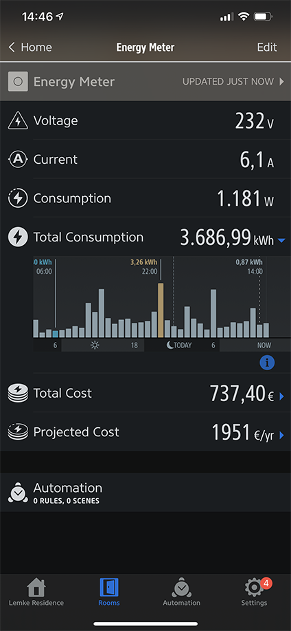

# Homebridge 3em Energy Meter

homebridge_shelly_3em is a plugin for [Homebridge](https://github.com/homebridge/homebridge) that implements Shelly 3EM energy metering functionality in Homekit.

This plugin uses http requests to a Shelly 3EM device, making it possible to retain the native Shelly cloud statistics (which use MQTT) and at the same time allow you to monitor your energy consumption via Homekit. 

Please note that due to the fact that Apple does not support energy characteristics in Homekit, this plugin's accessory will only show values in the third-party homekit application "EVE".

[]

It will show in the EVE application the following values: Consumption and the Total Consumption. A Total Cost and Projected Cost will show if you have specified the Energy Cost in the settings section of your EVE application. Total Consumption and Total Cost will feature the fakegato-history graph.

This application uses the fakegato plugin ([simont77/fakegato-history](https://github.com/simont77/fakegato-history)).

# Installation Instructions

You can easily install this plugin by using the  [Homebridge Config UI X](https://www.npmjs.com/package/homebridge-config-ui-x). Search for "homebridge_shelly_3em" in the "Plugins" tab and install the plugin. After that fill out the configuration by using the "SETTINGS" link below the installed plugin.

Alternatively, can you install the plugin by 

             npm install -g homebridge_shelly_3em

and then edit your Homebridge's config.json to include the following in the accessories section:

        {
            "accessory": "3EMEnergyMeter",
            "name": "Energy Meter",
            "ip": "192.168.0.1",
            "auth": {
                "user": "",
                "pass": ""
            },
            "timeout": 5000,
            "update_interval": 10000,
            "use_em": false,
            "use_em_mode": 0,
            "negative_handling_mode": 0,
            "use_pf": false,
            "debug_log": false,
            "serial": "123456789012345"             
        },

* "name"              			The Homekit Accessory Name.
* "ip"                			The IP address of your Shelly 3EM.
* "user" and "pass"   			If your Shelly 3EM local web page is password protected specify "user" and "pass".
* "timeout"           			The http/get request timeout in msec. This timeout must the less than the "update_interval", default is 5000.
* "update_interval"   			The interval for pulling values in msec. Must be greater than "timeout" setting, default is 10000.
* "use_em"            			Use this plugin with a Shelly EM device.
* "use_em_mode" 						Set the mode when use_em is true. Set to 0 to combine channel1 and channel2. Use 1,2 when single channels should be used,respectively.
* "use_pf"            			Enables the Power Factor (pf) usage when calculating Total Ampere.
* "negative_handling_mode"	Defines what happens with negative values. Set to 0 to zero them or 1 to show them as absolute values.
* "debug_log"         			Enables the debug logging of the plugin, default is false.
* "serial"            			This sets the published serialNumber of the accessory. It is required to use an unique serial for fakegato-history to work correctly.

Shelly EM functionality is beta, please use at own risk as I could not test it on a real EM device.
The creator of this plugin is not affiliated in any way with [Shelly(Allterco)](https://shelly.cloud/) or [EVE](https://www.evehome.com/).

